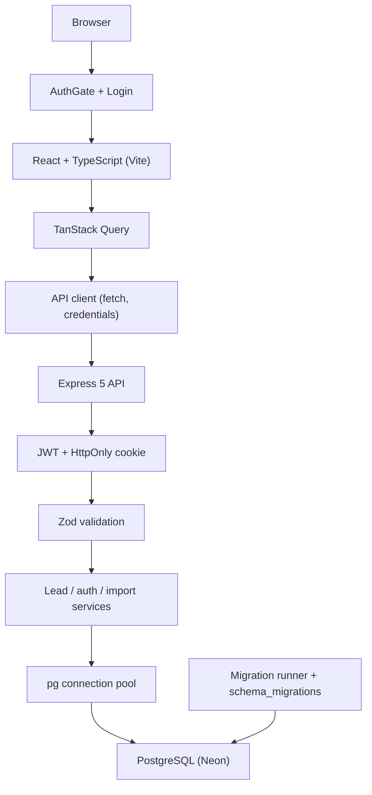

# Stylework Lead Tracker

## Overview

Stylework Lead Tracker is a full-stack web application for capturing and managing sales leads. Authenticated users can create, search, filter, sort, paginate, edit, delete, and update lead status from a single-page UI. The backend exposes a JSON REST API (plus CSV import/export) backed by PostgreSQL on Neon.

## Features

- **Create lead** — name, email, optional phone, and status (defaults to `new`)
- **List leads** — server-side pagination with `page`, `limit`, `total`, and `totalPages`
- **Search leads** — case-insensitive substring search
- **Search by scope** — `all`, `name`, `email`, or `phone`
- **Server-side sorting** — by `name`, `email`, or `status` (workflow order for status); ascending or descending; default list order is newest first when sort is omitted
- **Status filtering** — filter list by pipeline status
- **Created date range filtering** — `createdFrom` / `createdTo` (ISO dates)
- **Edit lead** — update name, email, phone, and status in a modal
- **Delete lead** — hard delete with confirmation
- **Inline status update** — per-row status selector
- **JWT authentication** — login, logout, and session verification
- **HttpOnly authentication cookie** — JWT stored in cookie (not `localStorage`)
- **CSV export** — download filtered/sorted leads (full result set; ignores `page`/`limit`)
- **CSV import** — upload CSV, preview validation, confirm import
- **CSV import preview** — row-level validation before any database write
- **Duplicate detection on import** — within-file and against existing leads (case-insensitive email)
- **Health check** — `GET /api/health` (public)

There is no public signup; admin users are provisioned with `npm run db:create-admin`.

## Architecture

The browser runs a React SPA behind an **AuthGate**: unauthenticated users see a login page; authenticated users see **Lead Tracker**. The shared API client uses `fetch` with `credentials: 'include'` so the HttpOnly JWT cookie is sent on API calls.

TanStack Query manages server state (paginated list, filters, sort, CRUD, status updates, import/export). The Express API validates input with Zod, runs business logic in services, and uses parameterized SQL via `pg`. Lead routes require JWT authentication (`requireAuth`). List/export/import share the same filter and sort query model where applicable.

Database schema changes are applied with versioned SQL migrations tracked in `schema_migrations` (`npm run db:migrate`).



## Tech Stack

| Layer | Technologies |
|--------|----------------|
| **Frontend** | React + TypeScript (React 19), Vite, plain CSS, TanStack Query, React Hook Form, Zod (`@hookform/resolvers`), ESLint |
| **Backend** | Node.js + Express + TypeScript (Express 5, ESM), `pg`, Zod, `jsonwebtoken`, `bcrypt`, `cookie-parser`, `cors`, `multer`, `csv-parse`, `exceljs`, `dotenv` |
| **Database** | PostgreSQL on [Neon](https://neon.tech) (`DATABASE_URL`) |
| **Deployment** | [Vercel](https://vercel.com) — static frontend and Express API (`backend/vercel.json`) |
| **Testing** | Backend: Vitest, Supertest. Frontend: Vitest, React Testing Library, jsdom, `@testing-library/user-event` |
| **Tooling** | `tsx` (dev/migrations/admin scripts), TypeScript (`tsc`) for backend production build |

The repo root `package.json` is metadata only; install and run scripts live under `backend/` and `frontend/`.

## Project Structure

```
stylework-lead-tracker/
├── README.md
├── AGENT.md
├── package.json
├── backend/
│   ├── vercel.json
│   ├── migrations/
│   │   ├── 001_create_leads.up.sql / .down.sql
│   │   └── 002_create_users.up.sql / .down.sql
│   ├── src/
│   │   ├── app.ts, index.ts
│   │   ├── config/           # env, database pool, auth cookie
│   │   ├── constants/        # status, sort, pagination, import limits
│   │   ├── controllers/      # HTTP handlers (leads, auth, import)
│   │   ├── middleware/       # requireAuth, CSV upload
│   │   ├── migrations/       # migration runner (schema_migrations)
│   │   ├── routes/           # health, auth, leads
│   │   ├── schemas/          # Zod request/query schemas
│   │   ├── services/         # leads, auth, import
│   │   ├── scripts/          # db-check, db-migrate, db-create-admin
│   │   ├── test/             # mocks, auth test helpers
│   │   └── types/
│   └── package.json
└── frontend/
    ├── src/
    │   ├── App.tsx           # AuthGate
    │   ├── features/auth/    # login, session
    │   ├── features/leads/   # LeadTrackerPage, import/export, API
    │   └── lib/              # api-client (JSON + blob), env
    └── package.json
```

## Authentication

Lead management requires a valid session.

| Topic | Behavior |
|--------|----------|
| **Login** | `POST /api/auth/login` with email/password; on success sets HttpOnly `auth_token` cookie |
| **JWT** | Signed with `JWT_SECRET`; lifetime from `JWT_EXPIRES_IN` (default `7d`); cookie `maxAge` matches JWT expiry |
| **Cookie** | `httpOnly`, `secure` + `sameSite: none` in production; `sameSite: lax` in development |
| **Protected routes** | All `/api/leads*` routes (including export/import) use `requireAuth` |
| **Logout** | `POST /api/auth/logout` clears the auth cookie |
| **Session check** | `GET /api/auth/me` returns the current user when the cookie is valid |
| **Signup** | Not implemented — use `npm run db:create-admin` to create the initial admin |
| **Client storage** | Do **not** store JWTs in `localStorage` or `sessionStorage`; the app relies on the cookie |

**Required backend env (auth):** `JWT_SECRET`, `JWT_EXPIRES_IN` (optional, default `7d`). For `db:create-admin`: `ADMIN_EMAIL`, `ADMIN_PASSWORD`.

## API Reference

Base path: `/api`

| Environment | API base URL |
|-------------|----------------|
| Local | `http://localhost:3000/api` |
| Production | `https://stylework-lead-tracker-backend.vercel.app/api` |

### Common response shapes

**Success (single lead):** `{ "success": true, "data": { ...lead } }`

**Success (paginated list):**

```json
{
  "success": true,
  "data": [ /* leads */ ],
  "pagination": {
    "page": 1,
    "limit": 20,
    "total": 42,
    "totalPages": 3
  }
}
```

**Validation error (400):** `{ "success": false, "error": { "message": "Validation failed", "details": [...] } }`

**Unauthenticated (401):** `{ "success": false, "error": { "message": "Authentication required" } }`

Timestamps in JSON are ISO 8601 (`createdAt`, `updatedAt`).

---

### `POST /api/auth/login`

**Body:** `{ "email": "...", "password": "..." }`

**Success:** `200` with user payload; sets HttpOnly auth cookie.

---

### `POST /api/auth/logout`

**Success:** `200`; clears auth cookie.

---

### `GET /api/auth/me`

Requires authentication.

**Success:** `200` with current user. **Errors:** `401` if not authenticated.

---

### `GET /api/health`

Public. **Success:** `200` — `{ "success": true, "message": "API is healthy" }` (no database required).

---

### `GET /api/leads`

Requires authentication. Paginated list with search, filters, and sort.

| Parameter | Notes |
|-----------|--------|
| `page` | Positive integer; default `1` |
| `limit` | Positive integer; default `20`; max `100` |
| `search` | Trimmed search string |
| `searchBy` | `all`, `name`, `email`, `phone` |
| `status` | `new`, `contacted`, `qualified`, `converted`, `lost` |
| `createdFrom` | `YYYY-MM-DD` |
| `createdTo` | `YYYY-MM-DD` |
| `sortBy` | `name`, `email`, `status` (omit for default `created_at` desc) |
| `sortOrder` | `asc`, `desc` |

Status sort uses workflow order (`new` → … → `lost`). **Success:** `200` with `data` and `pagination`.

---

### `POST /api/leads`

Requires authentication.

**Body:** `{ "name", "email", "phone"?, "status"? }` — `status` defaults to `new`; optional `phone` may be omitted or empty (stored as `null`).

**Success:** `201` with created lead. **Errors:** `400` validation.

---

### `PUT /api/leads/:id`

Requires authentication. **Path:** UUID `id`.

**Body:** `{ "name", "email", "phone"?, "status"? }` — full field update per `updateLeadSchema`.

**Success:** `200` with updated lead. **Errors:** `400` validation; `404` if lead not found.

---

### `PATCH /api/leads/:id/status`

Requires authentication. **Path:** UUID `id`.

**Body:** `{ "status": "new" | "contacted" | "qualified" | "converted" | "lost" }`

**Success:** `200` with updated lead. **Errors:** `400` validation; `404` if lead not found.

---

### `DELETE /api/leads/:id`

Requires authentication. **Path:** UUID `id`. Hard delete.

**Success:** `200` with confirmation message. **Errors:** `404` if lead not found.

---

### `GET /api/leads/export.csv`

Requires authentication. Accepts the same filter/sort query parameters as `GET /api/leads` **except** `page` and `limit`. Returns all matching rows as `text/csv` with `Content-Disposition` attachment filename `leads-YYYY-MM-DD.csv`.

---

### `POST /api/leads/import/preview`

Requires authentication. `multipart/form-data` field `file` (`.csv`, size limit enforced). Parses and validates rows (`name`, `email`, `phone`, `status` columns). **Does not write to the database.**

**Success:** `200` with preview payload, for example:

```json
{
  "success": true,
  "data": {
    "totalRows": 10,
    "validRows": 8,
    "invalidRows": 1,
    "duplicateRows": 1,
    "errors": [
      {
        "row": 5,
        "field": "email",
        "type": "duplicate",
        "message": "Email already exists"
      }
    ],
    "validLeads": [ /* rows safe to import */ ]
  }
}
```

Duplicate emails are detected within the file and against existing leads (trim + case-insensitive). Duplicate rows are **not** included in `validLeads`.

---

### `POST /api/leads/import/confirm`

Requires authentication. **Body:** `{ "leads": [ /* CreateLeadInput[] */ ] }` — must match server validation (`createLeadSchema`). Re-validates and re-checks duplicates inside a transaction; only non-duplicate rows are inserted. **Success:** `201` with `importedCount` and created leads.

---

## Lead Statuses

`new`, `contacted`, `qualified`, `converted`, `lost` — enforced in PostgreSQL and Zod.

## Database

| Object | Purpose |
|--------|---------|
| **`leads`** | Lead records (UUID, name, email, phone, status, timestamps, indexes) |
| **`users`** | Admin users (`email` unique, `password_hash`) |
| **`schema_migrations`** | Applied migration versions (`version`, `name`, `applied_at`) |

**Scripts (from `backend/` with `DATABASE_URL` set):**

| Command | Purpose |
|---------|---------|
| `npm run db:check` | Connectivity check |
| `npm run db:migrate` | Apply pending `.up.sql` migrations (idempotent; skips applied) |
| `npm run db:migrate:down` | Roll back **latest** applied migration only |
| `npm run db:create-admin` | Create admin user (`ADMIN_EMAIL` / `ADMIN_PASSWORD`) |

On first run against an existing database that already has `leads` / `users` but no history, the runner **bootstraps** `schema_migrations` by detecting those tables (then uses history as source of truth).

## Local Development

### Prerequisites

Node.js (LTS), npm, PostgreSQL (e.g. Neon).

### Install

```bash
git clone https://github.com/Aman-Sigroha/stylework-lead-tracker.git
cd stylework-lead-tracker
cd backend && npm install
cd ../frontend && npm install
```

### Environment

**Backend** (`backend/.env` from `.env.example`):

```env
PORT=3000
NODE_ENV=development
DATABASE_URL=postgresql://...
JWT_SECRET=your-secret
JWT_EXPIRES_IN=7d
# CORS_ORIGIN=http://localhost:5173
```

**Frontend** (`frontend/.env`):

```env
VITE_API_BASE_URL=http://localhost:3000/api
```

### Database and admin

```bash
cd backend
npm run db:migrate
npm run db:create-admin
```

### Run

```bash
# backend/
npm run dev

# frontend/
npm run dev
```

Frontend: `http://localhost:5173` · API: `http://localhost:3000/api`

## Environment Variables

| Variable | Where | Purpose |
|----------|--------|---------|
| `DATABASE_URL` | Backend | PostgreSQL (**required** for lead/auth data) |
| `JWT_SECRET` | Backend | JWT signing (**required** for auth) |
| `JWT_EXPIRES_IN` | Backend | Token/cookie lifetime (default `7d`) |
| `ADMIN_EMAIL` / `ADMIN_PASSWORD` | Backend | `db:create-admin` only |
| `CORS_ORIGIN` | Backend | Allowed origins for credentialed CORS (required in production) |
| `PORT` | Backend | Local dev server port (default `3000`) |
| `NODE_ENV` | Backend | Local development only |
| `VERCEL` | Backend | Set by Vercel at runtime |
| `VITE_API_BASE_URL` | Frontend | API base URL at build time |

Never commit secrets.

## Testing

Run from `backend/` or `frontend/`.

### Backend

```bash
npm test
npm run build
```

**150** tests (Vitest + Supertest). HTTP and migration-runner tests use mocked `pg` / filesystem boundaries; no live Neon required for CI-style runs.

### Frontend

```bash
npm test
npm run build
npm run lint
```

**93** tests (Vitest + React Testing Library). `leads-api` and auth APIs are mocked.

## Build

**Backend:** `npm run build` → `dist/` · **Frontend:** `npm run build` → `dist/`

## Deployment

**Live demo:** [https://stylework-lead-tracker.vercel.app](https://stylework-lead-tracker.vercel.app)

| Component | URL |
|-----------|-----|
| Frontend | https://stylework-lead-tracker.vercel.app |
| Backend API | https://stylework-lead-tracker-backend.vercel.app/api |
| Database | Neon (`DATABASE_URL` on backend project only) |

### Vercel checklist

1. **Database** — run `npm run db:migrate` against production Neon when schema changes (safe to re-run; pending only).
2. **Backend project** (`backend/`) — set `DATABASE_URL`, `JWT_SECRET`, `JWT_EXPIRES_IN`, `CORS_ORIGIN` (frontend origin). Do **not** set `PORT` or `NODE_ENV` for Vercel; runtime is managed by the platform.
3. **Frontend project** (`frontend/`) — set `VITE_API_BASE_URL=https://stylework-lead-tracker-backend.vercel.app/api` before build.
4. Create admin with `db:create-admin` against production (locally with production `DATABASE_URL`, not committed).

Health: `GET https://stylework-lead-tracker-backend.vercel.app/api/health`

## Engineering Trade-offs

- **PostgreSQL + parameterized SQL** — Constraints, indexes, and safe dynamic filters/sort via whitelists
- **Layered API** — routes → controllers → services
- **Zod at the boundary** — Consistent validation for JSON and query params
- **Server-side pagination, filtering, and sorting** — Scales beyond a single browser-side list
- **JWT in HttpOnly cookie** — Avoids XSS token theft from `localStorage`; requires correct CORS/credentials
- **Hard delete** — No soft-delete or undo
- **CSV import two-step flow** — Preview + confirm; server always re-validates
- **Duplicate import handling** — Email normalized (trim, lowercase); no DB unique on `leads.email` (duplicates allowed for manual creates; import blocks duplicates intentionally)
- **Migration history** — `schema_migrations` with per-migration transactions and legacy bootstrap for existing Neon schemas
- **Test boundaries** — Mock `query` / API modules for fast, credential-free tests

## Limitations / Future Work

- No self-service signup or role-based permissions beyond a single admin model
- No audit log of field/status changes
- No rate limiting or production observability stack in-repo
- `leads.email` is indexed but not globally unique (import duplicate rules are separate from manual entry)
- Optional CI workflow not included in this repository

## Design / UX Notes

- Login gate, then single-page Lead Tracker: search, filters, sort, pagination, import/export, table with inline status, modals for create/edit, delete confirmation
- Search debounced (~300ms); export uses current filter/sort state; import shows preview counts (ready / duplicates / invalid)

## Assumptions

- Phone optional; empty phone stored as `null`
- Default status on create: `new`
- Export returns all rows matching filters, not only the current page

## AI-Assisted Development

See **AGENT.md** for tool usage, workflow, and verification history.
